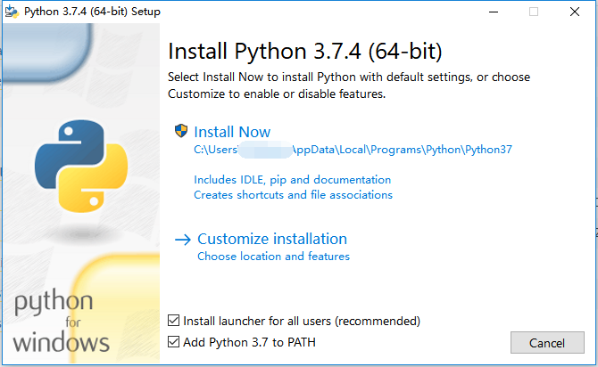
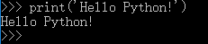

###一、Python执行环境以及开发环境的安装
**1、Python执行环境**
从[Pythoin的官方网站](https://www.python.org/)菜单的Downloads栏目下载Python 3.x版本的安装文件，然后双击打开，点击安装即可,如下图所示:

记得勾选Add Python 3.7 to PATH,添加到环境变量能够带来很多便利。在自定义安装中，可以选择将很多认为不需要的不安装。但是个人认为还是安装比较好。PIP是安装第三方包的工具。Python之所以强大，就是因为第三方库非常多且好用。

**2、Python的开发环境**
有很多专门的开发软件，如PyCharm,SublimeText, VsCode等。做数据分析的话，个人推荐Anaconda+PyCharm。Anaconda是很强大的一个数据科学工具，jupyter notebook和spyder是数据分析利器。Pycharm则是进行Python开发的利器。
Anaconda可以从[官网](https://www.anaconda.com/distribution/)下载,Pycharm则从官网下载社区版本即可，然后默认安装即可。

**3、命令行运行Python**
安装好Python后，在windows的左下角的搜索框内搜索cmd，即可进入命令行。然后在命令行中输入python，即进入python运行环境。
然后我们输入
`print('Hello Python!')
`
则得到如下输出:

然后我们进入Python的世界！

###二、Python基本数据类型和变量
**基本数据类型**
所有编程语言中都有自己的数据类型。但是基本的数据类型大致都差不多，如：整型数、浮点数、长整型、数组、字符串等。

|类型  |英文类型|示例|
|-|-|-|
|整型|int|1 2 5 1000 -100|
|浮点数|float|1.23 3.14 9.01|
|字符串|str|'I'm OK' 'Hello Python'|
|列表|list|[1,2,3,4,5] [3,4,100,-10]|
|字典|dict|{'a':1,'b':2,'c':3} s = ['python', 'java',['asp', 'php'], 'scheme']|
|元组|tuple|('a','b','d','e')  ('a', 'b', ['A', 'B'])|
从上表可见：list中可以再包含list，tuple中可以包含多种数据元素，字符串和列表，以及整数，浮点数都可以包含进去。由此可见Python是非常灵活的。

**变量**
在Python代码中，等号左边的是变量，右边的是值。如：a=3, 则a是变量，3是值；或者a=3,b=a,a就先是变量，后面变成了值，赋给了b。在所有编程语言中，等号(=)都是赋值符号。一些符号可以被重新定义重载，这里不细说。